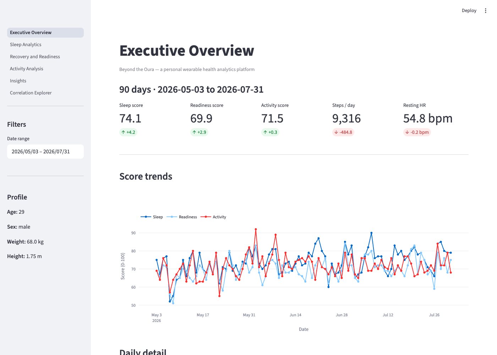
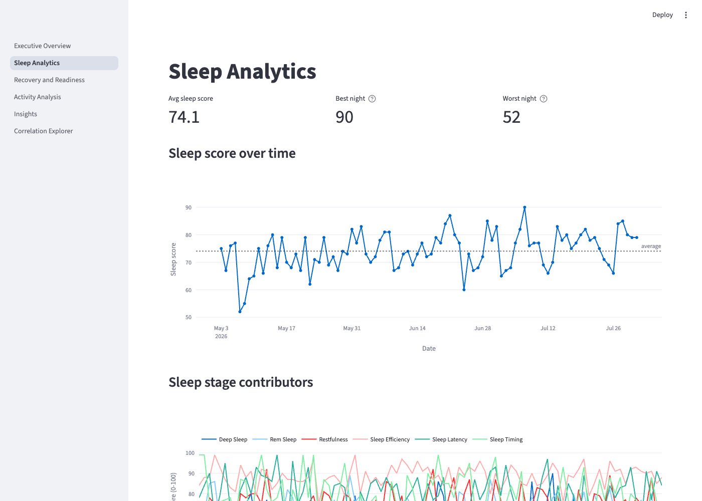
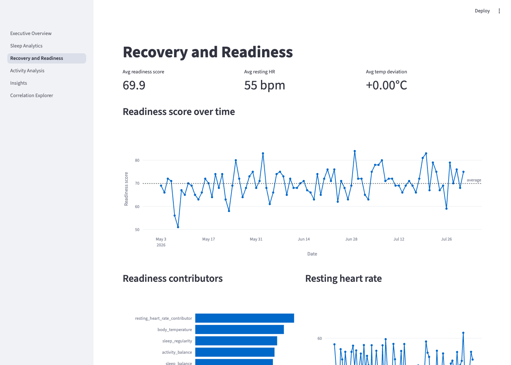
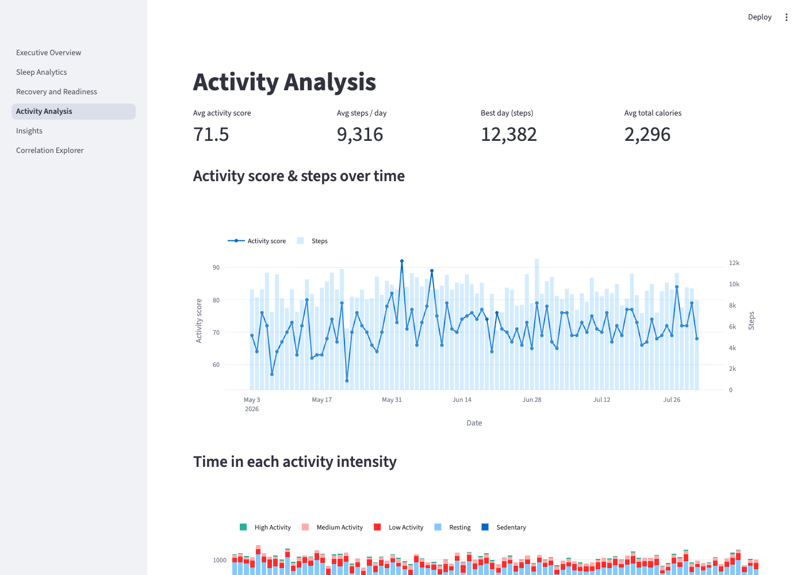
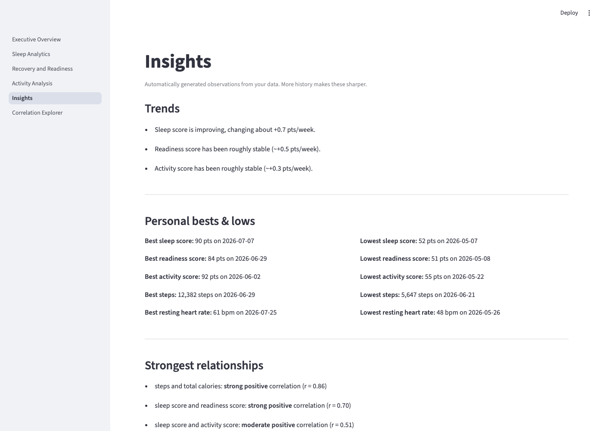
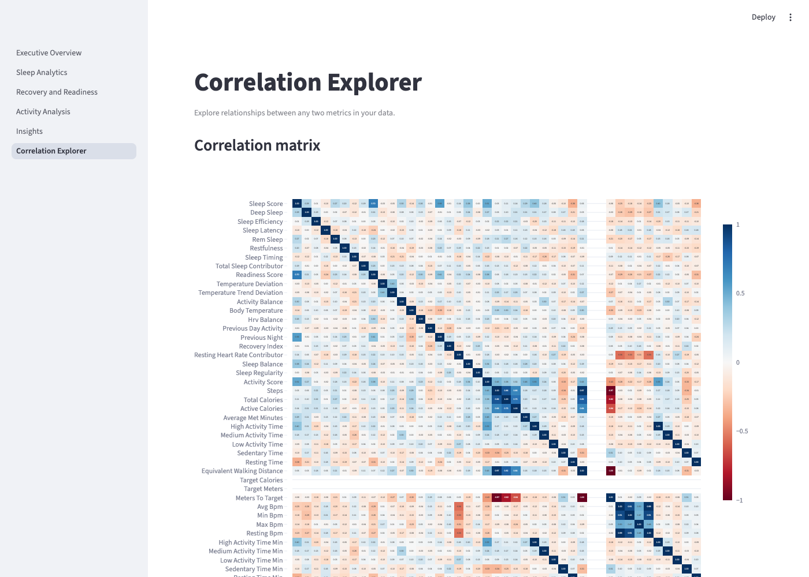

# Beyond the Oura

A wearable health analytics platform built on top of the Oura Ring API, a
reusable data pipeline, statistical analysis, and an interactive Streamlit
dashboard with AI-generated insights.

This repo ships with **90 days of synthetic sample data** so it runs
end-to-end out of the box, with no Oura account required. Swap in your own
export any time (see [Using your own Oura data](#using-your-own-oura-data)).



## What this is

This project began as a personal tool for understanding my own health data. I wanted a more comprehensive view of the information captured by my Oura Ring, especially the relationships between metrics that are often presented separately in the Oura app.

The version in this repository is a public sample that demonstrates the dashboard’s structure, features, and analytical approach without including my private health data. I am continuing to refine and expand my personal version as I explore new metrics, visualizations, and ways to identify meaningful patterns and irregular trends over time.

Individually wearable apps show you *your* numbers. This project is the
layer on top: it pulls raw Oura data through a repeatable pipeline, cleans
and integrates it into one daily table, runs statistical analysis over it,
and surfaces the result as a six-page dashboard, including natural-language
insights written by an LLM that's grounded in your actual computed stats. This dashboard explores relationships between Oura metrics that are typically presented separately in the app, helping users uncover meaningful patterns and identify unusual trends over time.


**Core features**
- **Data engineering** OAuth2 ingestion from the Oura API, CSV storage, a
  shared cleaning/merge pipeline
- **Analytics** trend detection (linear regression), correlation analysis
  across every sleep/readiness/activity/heart-rate metric
- **Visualization** six Plotly-powered dashboard pages in Streamlit
- **AI insights** short narrative callouts generated per-chart from your
  computed stats (OpenAI API), with a rule-based fallback when no API key
  is configured

## Screenshots

| | |
|---|---|
|  Sleep Analytics |  Recovery and Readiness |
|  Activity Analysis |  Insights |

<details>
<summary>Correlation Explorer</summary>


</details>

## Architecture

```
Oura API → data collection → data cleaning → integrated dataset
         → statistical analysis → interactive dashboard → insights
```

- **Collection** ([auth.py](auth.py), [download.py](download.py)) — OAuth2
  login, pulls sleep/readiness/activity/heart-rate/personal-info into CSVs
- **Cleaning + integration** ([dashboard/data.py](dashboard/data.py)) —
  renames and merges every source into one daily table, cached per session
- **Analysis** — linear-regression trend detection, Pearson correlations,
  all computed inline in the dashboard pages
- **Dashboard** ([dashboard/](dashboard)) — six Streamlit pages: Executive
  Overview, Sleep Analytics, Recovery and Readiness, Activity Analysis,
  Insights, Correlation Explorer
- **AI insights** ([dashboard/ai_insights.py](dashboard/ai_insights.py)) —
  feeds computed stats (never raw data) to GPT-4o-mini, cached per data
  snapshot so it isn't re-called on every page reload

## Tech stack

Python · Pandas · NumPy · Plotly · Streamlit · Scikit-learn · OpenAI API ·
Oura API

## Quick start

```bash
git clone <this-repo-url>
cd beyond-the-oura
python3 -m venv .venv
source .venv/bin/activate    # Windows: .venv\Scripts\activate
pip install -r requirements.txt
streamlit run dashboard/Executive_Overview.py
```

That's it. The dashboard opens at `http://localhost:8501` using the
synthetic sample data already in `data/`.

**Optional: AI-generated insights.** Add an OpenAI key to enable the ✨
insight callouts above each chart:
```bash
cp .env.example .env
# then edit .env and set OPENAI_API_KEY=sk-...
```
Without a key, those callouts simply don't render — nothing else changes.

## Using your own Oura data

1. Regenerate the sample data any time with `python generate_sample_data.py`
   (see [generate_sample_data.py](generate_sample_data.py) — it's fully
   synthetic, built from a shared "wellness" latent variable, not real data).
2. To pull your real data instead: register an app at
   [developer.ouraring.com](https://developer.ouraring.com), copy
   `.env.example` to `.env`, fill in `OURA_CLIENT_ID` / `OURA_CLIENT_SECRET`,
   then:
   ```bash
   python main.py auth       # one-time OAuth2 login
   python main.py download   # overwrites data/*.csv with your real export
   ```
3. Re-run the dashboard — same command, now backed by your real data.

Column names produced by `download.py` match what `dashboard/data.py`
expects, so no code changes are needed either way.

## Project layout

```
.
├── auth.py                    # OAuth2 login flow
├── download.py                # Fetch data → CSV
├── main.py                    # CLI entry point (auth / download)
├── generate_sample_data.py    # Synthetic dataset generator
├── data/                      # CSVs (synthetic by default)
├── dashboard/
│   ├── Executive_Overview.py  # Entry point / landing page
│   ├── data.py                 # Shared loading, cleaning, merging
│   ├── ai_insights.py          # OpenAI-backed insight generation
│   └── pages/                  # Sleep, Recovery, Activity, Insights, Correlation Explorer
└── requirements.txt
```

## Future enhancements

- Predictive models (e.g. forecasting next-day readiness)
- Support for other wearables (Whoop, Garmin, Apple Watch)
- Automated weekly email/report summaries
- Natural-language Q&A over your own data

## Privacy note

The `data/` folder in this repo is synthetic — no real person's health data.
If you plug in your own Oura export, `.gitignore` already excludes your
`.env` (API keys) and `data/tokens.json` (OAuth tokens), but the CSVs
themselves are *not* excluded by default. Keep this repo private, or add
`data/*.csv` to `.gitignore`, before pushing your real data anywhere public.
